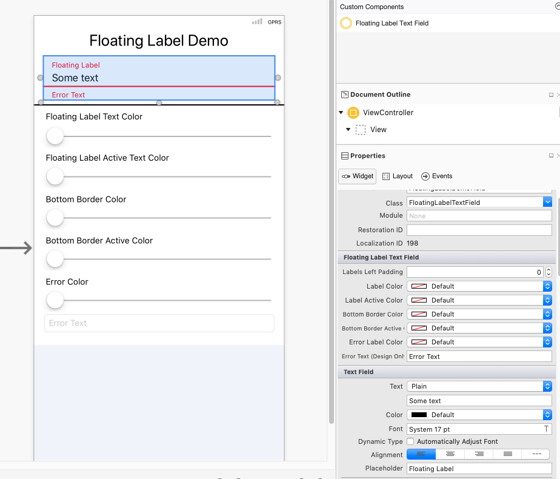

# FloatingLabel-Xam.iOS

Library that provides a [Material like Floating Label](https://material.io/develop/web/components/input-controls/floating-label/) for Xamarin.iOS with designer support. 

This library is an extension of the existing one ported by [Greg Shackles](https://github.com/gshackles/FloatLabeledEntry). It provides an error field, a bottom line to separate the text fields from the error label and also the ability to edit colors of the several components.

### Sample demo

### Designer support

